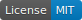
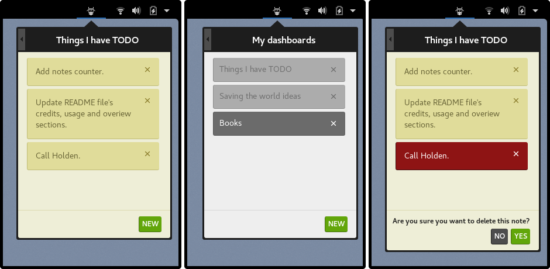

    

    Manage your quick notes at the top bar with
    <strong>vacanote</strong>, a
    <a href="https://wiki.gnome.org/Projects/GnomeShell/Extensions">GNOME Shell extension</a>.

## Overview
Vacanote (bakanəʊt) is a [GNOME Shell extension][gnome] for organizing your notes by dashboard/category, having them all at the top bar for quick search. It grows downwards to fill your screen: get maximum visibility without being invasive.

### Usage
- Start editing by clicking either a note or your dashboard's title.
- `ESC` to close the applet.

## Installation

Get vacanote with Git:

    git clone https://github.com/luvejo/vacanote.git

Or  [Download as ZIP][zip-download].

To make the extension readable for the GNOME Shell, you need to move it to the `~/.local/share/gnome-shell/extensions/` directory:

    mv vacanote/src ~/.local/share/gnome-shell/extensions/vacanote@luvejo.github.io

Unless you're planning to contribute, you can get rid of this:

    yes | rm -r vacanote

Time to enable it:

    gnome-shell-extension-tool --enable-extension=vacanote@luvejo.github.io

You may need to login again.

Enjoy!

## Debugging

In `/path/to/extension/config/settings.js` set the DEBUG flag to `true`. Find the debugging messages at:

    journalctl /usr/bin/gnome-shell -f

## Screenshots

## License

This project is licensed under the MIT License. See the [LICENSE](LICENSE) file for details.

## Credits
Thanks to these projects I didn't have to bother that much at Stack Overflow.
- **Thomas Moreau**'s  [ToDoList][todolist].
- **Yotam Bar-On**'s [gnome-shell-extension-clipboard-indicator][clipboard-indicator].
- **zagortenay333**'s [timepp__gnome][timepp-gnome] and [timepp__cinnamon][timepp-cinnamon].

[gnome]: https://wiki.gnome.org/Projects/GnomeShell/Extensions
[zip-download]: https://github.com/luvejo/vacanote/archive/master.zip
[todolist]: https://github.com/tomMoral/ToDoList
[clipboard-indicator]: https://github.com/Tudmotu/gnome-shell-extension-clipboard-indicator
[timepp-gnome]: https://github.com/zagortenay333/timepp__gnome
[timepp-cinnamon]: https://github.com/zagortenay333/timepp__cinnamon
